TAssist is a **desktop application** for Teaching Assistants (TAs) from NUS School of Computing to easily track and manage student information. It is optimized for use via a **Command Line Interface** (CLI), complemented by a user-friendly Graphical User Interface (GUI). If you can type fast, TAssist helps you complete student management tasks more quickly than traditional GUI-based apps.

* Table of Contents
{:toc}

--------------------------------------------------------------------------------------------------------------------
## Quick start

1. Ensure you have Java `17` or above installed in your Computer.<br>
   **Mac users:** Ensure you have the precise JDK version prescribed [here](https://se-education.org/guides/tutorials/javaInstallationMac.html).

2. Download the latest `.jar` file from [here](https://github.com/AY2425S2-CS2103T-W12-4/tp/releases).

3. Copy the file to a folder you want to use as the _home folder_ for TAssist.

4. Open the Command Prompt (Windows) or Terminal (Mac/Linux)

5. Navigate to the folder where you saved the `[CS2103T-W12-4][TAssist].jar` file using `cd` command<br>
   Example (Windows): `cd C:\Users\YourName\Downloads`. <br>
   Example (Mac/Linux): `cd /Users/YourName/Downloads`.

6. Type the following command and press Enter to run the application.<br>
    ```java -jar [CS2103T-W12-4][TAssist].jar```

7. A GUI similar to the below should appear in a few seconds. Note how the app contains some sample data.<br>
   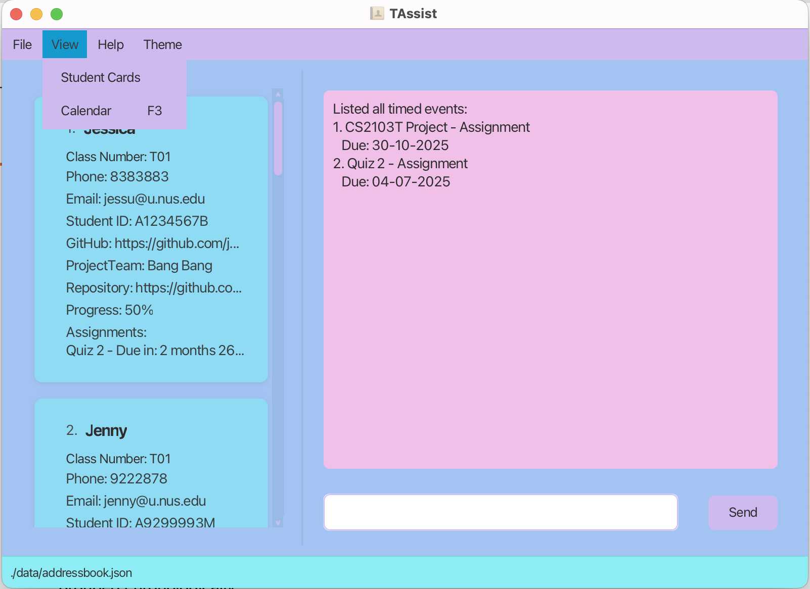

8. Type the command in the command box and press Enter to execute it. e.g. typing **`help`** and pressing Enter will open the help window.<br>
    Some example commands you can try:

   * `list` : Lists all contacts.

   * `add n/John Doe p/98765432 e/johnd@u.nus.edu s/A0135246R` : Adds a contact named `John Doe` to the student list.

   * `delete 3` : Deletes the 3rd contact shown in the current list.

   * `clear` : Deletes all contacts.

   * `exit` : Exits the app.

9. Refer to the [Features](#features) below for details of each command.

--------------------------------------------------------------------------------------------------------------------
## Tips

1. If you are already familiar with TAssist, you can jump straight to our [Command Summary Table](#Command-summary) to view all available commands.

2. To access this User Guide quickly, simply press `F1` key at any time.

3. TAssist allows users to personalize the appearance of the application by switching between different color themes.<br>
   Users can press the `F2` key to cycle through the available themes. <br>
   Available themes: Dark, Bright, Pink

4. Viewing Upcoming Events Calendar: `F3`<br>
   TAssist provides a calendar-style view to help you visualize upcoming assignments and timed events. Events are grouped and displayed by their due dates, along with the list of students assigned to each.
    * Press the F3 key to open the calendar-style event viewer.
    * Display includes: Assignment names, Event type (e.g., assignment), Assigned students, Dates grouped chronologically
    * An empty calendar will be shown if there are no current Assignments.

5. Use student ID and index interchangeably.<br>
   Most commands support both student ID and list index. 
   For example:<br>
   `github 1 g/https://github.com/johndoe`<br>
   or <br>
   `github A1234567B g/https://github.com/johndoe`<br>

--------------------------------------------------------------------------------------------------------------------


## Features

<div markdown="block" class="alert alert-info">

**:information_source: Notes about the command format:**<br>

* Words in `UPPER_CASE` are the parameters to be supplied by the user.<br>
  e.g. in `add n/NAME`, `NAME` is a parameter which can be used as `add n/John Doe`.

* Items in square brackets are optional.<br>
  e.g. `n/NAME [t/TAG]` can be used as `n/John Doe t/friend` or as `n/John Doe`.

* Items with `…`​ after them can be used multiple times including zero times.<br>
  e.g. `[t/TAG]…​` can be used as ` ` (i.e. 0 times), `t/friend`, `t/friend t/family` etc.

* Parameters with prefix (p/, c/ etc.) can be in any order.<br>
  e.g. if the command specifies `n/NAME p/PHONE_NUMBER`, `p/PHONE_NUMBER n/NAME` is also acceptable.

* Extraneous parameters for commands that do not take in parameters (such as `help`, `exit` and `clear`) will be ignored.<br>
  e.g. if the command specifies `help 123`, it will be interpreted as `help`.

* If you are using a PDF version of this document, be careful when copying and pasting commands that span multiple lines as space characters surrounding line-breaks may be omitted when copied over to the application.

* Refer to [Parameters](#parameters) for more information.
</div>

### Viewing help : `help`

Opens the User Guide in your default browser and displays a message containing the link. <br>
If the browser does not open automatically, you can manually copy and paste the link into your browser.


Format: `help`

<div markdown="span" class="alert alert-primary">
💡 <strong>Tip:</strong> You can open also do this by pressing <code>F1</code>
</div>


### Adding a student: `add`

**Adds** a student to the student list.

Format: `add n/NAME p/PHONE_NUMBER e/EMAIL s/STUDENT_ID [g/GITHUB_URL] [r/REPOSITORY] [pt/TEAM] [c/CLASS_NUMBER] [t/TAG]…​ [pr/PROGRESS]`
* The parameters `NAME`, `PHONE_NUMBER`, `EMAIL`, and `STUDENT_ID` must be present. The rest are optional.
* For more detailed information on each parameter, please read [Parameters](#parameters)
* **Note:** Ensure that the `PHONE_NUMBER`, `EMAIL`, `STUDENT_ID`, and `GITHUB` entered are unique, to avoid a duplicate entry error.

<div markdown="span" class="alert alert-primary">
:bulb: <strong>Tip:</strong> A student can have any number of tags (including 0)
</div>

Examples:
* `add n/John Doe p/98765432 e/johnd@u.nus.edu s/A0000000B pt/ProjectTeam1 c/T01 t/ExchangeStudent pr/50`
* `add n/Betsy Crowe t/friend e/betsycrowe@u.nus.edu s/A0123456U g/https://github.com/betsy p/1234567 t/LifeScienceMajor`
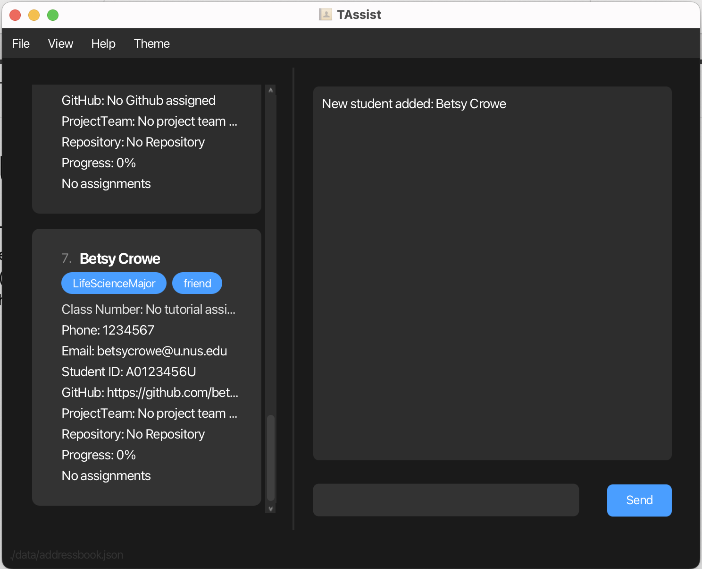

### Listing, Filtering and Sorting students : `list`

Shows a **list of all students** in the student list.

Format: `list [f/FILTER_TYPE fv/FILTER_VALUE] [s/SORT_TYPE o/SORT_ORDER]` <br>

* All parameters are optional. Filters and sorting can be used together or independently.
* **Note:** Once a sort is applied using the list command, the list will remain sorted in that order throughout the session.
  To apply a different sort, use list again with a new sort type and order.
  If a sort is applied on a field where multiple students share the same value, their positions may change randomly after add/edit/update operations due to tie-breaking by the system.

#### Filter Options
`FILTER_TYPE:`<br>
* progress: Filters students whose progress is less than or equal to the provided value.
* team: Filters by existing team names.
* class: Filters by existing class number.

`FILTER_VALUE:`<br>
* PROGRESS: An integer between 0 and 100.
* TEAM: Must match an existing team name.
* CLASS: Must match an existing class number.

#### Sort Options
`SORT_TYPE:`<br>
* name
* progress
* github

`SORT_ORDER:`<br>
* asc — Ascending (A → Z or lowest → highest).
* des — Descending (Z → A or highest → lowest).

Examples:
* `list`<br>
  Displays all students.
* `list f/progress fv/60` <br>
  Displays students with progress ≤ 60.
* `list s/github o/asc`<br>
  Displays all students, sorted by Github username in ascending lexicographical order.
* `list f/progress fv/50 s/name o/des`<br>
  Displays students with progress ≤ 50, sorted by name in descending lexicographical order.
* `list f/team fv/Bang Bang`<br>
  Displays students with the Team name 'Bang Bang', matched case-insensitively.


### Editing a student : `edit`

Edits an existing student in the student list.

Format: `edit INDEX [n/NAME] [p/PHONE] [e/EMAIL] [c/_NUMBER] [s/STUDENTID] [g/GITHUB_URL] [pt/TEAM] [c/CLASS_NUMBER] [t/TAG]…​ [pr/PROGRESS]`

* Edits the student at the specified `INDEX`. The index refers to the index number shown in the displayed student list.
* The index **must be a positive integer** 1, 2, 3, …​
* At least one of the optional fields must be provided.
* Existing values will be updated to the valid input values.
* When editing tags, the existing tags of the student will be removed i.e. adding of tags is not cumulative.
* You can remove all the student's tags by typing `t/` without
    specifying any tags after it.
* **Tip:** `edit` cannot be used to remove optional fields `Github` and `class`. To do so, refer to the respective sections [Class](#assigning-or-removing-a-tutorial-class-class) or [Github](#updating-a-students-github-link-github)


Examples:
*  `edit 1 p/91234567 e/johndoe@u.nus.edu`<br>
    Edits the phone number and email address of the 1st student to be `91234567` and `johndoe@u.nus.edu` respectively.
*  `edit 7 n/Betsy Crower t/` <br>
    Edits the name of the 2nd student to be `Betsy Crower` and clears all existing tags.

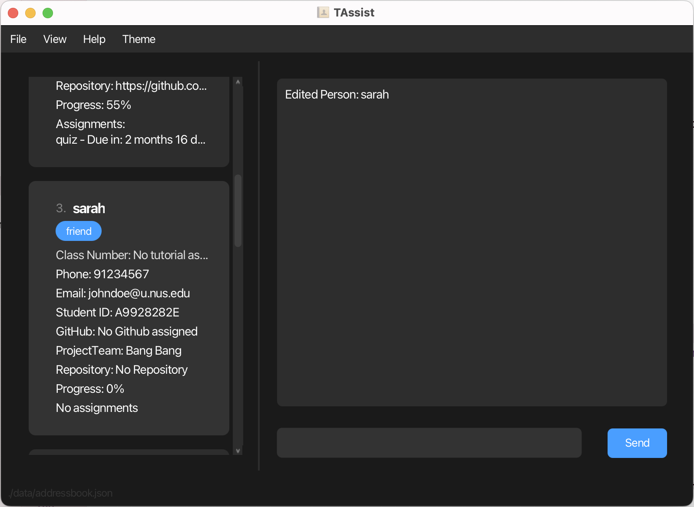
### Locating student(s) by Name, StudentID, or Class: `find`

Finds students whose names contain any of the given inputs, whose student ID matches exactly, or whose class number matches exactly.

Format: `find NAME [MORE_NAMES]` or `find STUDENT_ID` or `find CLASS_NUMBER`

* The search is case-insensitive. e.g. `hans` will match `Hans`
* The order of the names does not matter. e.g. `Hans Bo` will match `Bo Hans`
* Partial words will be matched e.g. `Han` will match `Hans`
* Students matching at least one name will be returned (i.e. `OR` search).
  e.g. `Han Bo` will return `Hans Gruber`, `Bo Yang`
* If a valid student ID is entered (e.g. `A1234567B`), it will return the student with an exact match on that ID.
* If a valid class number is entered (e.g. `T01`), it will return all students in that class.

Examples:
* `find John` returns `john` and `John Doe`
* `find alex david` returns `Alex Yeoh`, `David Li`<br>
  
* `find A1234567B` returns the student with that exact student ID
* `find T01` returns all students in tutorial class T01

### Assigning or Removing a tutorial class: `class`

Assigns or removes a **tutorial/recitation class** for a student identified by either their displayed index or student ID

Format: `class INDEX c/CLASS_NUMBER` or `class STUDENT_ID c/CLASS_NUMBER`

* `CLASS NUMBER` must be either `Txx`, `Rxx` or `Lxx` where xx is integer from 01 to 99, (e.g. T15, R05, L99)
    * Note: 'T', 'R' and 'L' must be uppercase.
    * 'T', 'R' and 'L' represent Tutorial, Recitation and Lab respectively.
    * If assigning 'Lxx', a capital letter suffix is optional (e.g. L01C).
* Assigns or updates the class of the student at the specified `INDEX` or matching `STUDENT_ID`
* The index refers to the index number shown in the displayed student list.
* The index **must be a positive integer** 1, 2, 3, …​
* To remove a class assignment, leave `c/` empty (i.e. `c/` with no value)

Examples:
* `class 1 c/T01` <br>
   Assigns class T01 to the 1st student in the list.
* `class 2 c/` <br>
   Removes the class from the 2nd student.
* `class A1234567B c/R05`<br>
   Assigns class R05 to the student with student ID `A1234567B`.

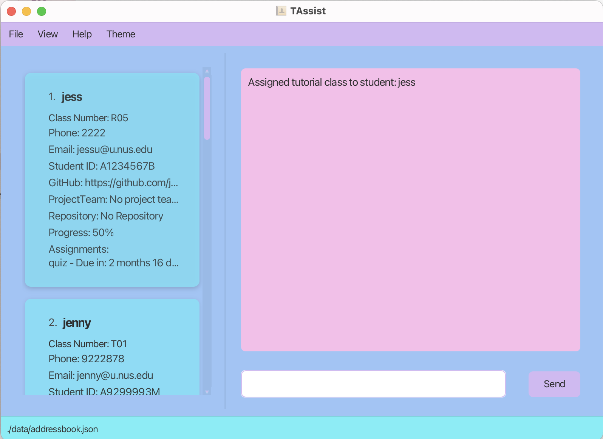
### Updating a student's repository link: `repo`

Updates the **GitHub repository URL** of a student, identified by either their displayed index or student ID.

**Format:**  
`repo INDEX un/GITHUB_USERNAME rn/REPOSITORY_NAME`<br>
or `repo STUDENT_ID un/GITHUB_USERNAME rn/REPOSITORY_NAME`<br>
or `repo INDEX r/REPOSITORY_URL`<br>
or `repo STUDENT_ID r/REPOSITORY_URL`

- The repository URL will be overwritten by the new input.
- Either `INDEX` (a positive integer) or `STUDENT_ID` must be provided.
- You may specify the repository using either:
    - `un/` and `rn/` (GitHub username and repository name), or
    - `r/` with a full GitHub repository URL.

#### Username (`un/`)
- Must be 1 to 39 characters long.
- Made up of alphanumeric characters.
- Separated by dashes (-) between segments.
- Cannot start or end with a dash.

#### Repository Name (`rn/`)

- Made up of alphanumeric characters.
- Can contain dashes (-), underscores (_), and dots (.).
- Cannot be empty.
- Must start and end with an alphanumeric character.

#### Repository URL (`r/`)

- Must be in the format: `https://github.com/[USERNAME]/[REPOSITORY_NAME]`
- `[USERNAME]` follows the same rules as above

**Examples:**
- `repo 2 un/Group-4 rn/WealthVault`<br>
  Updates the repository of the 2nd student in the list to `https://github.com/Group-4/WealthVault`
- `repo A0891334N un/Tutorial-G08 rn/BestApp`<br>
  Updates the repository for student with student ID `A0891334N` to `https://github.com/Tutorial-G08/BestApp`
- `repo 3 r/https://github.com/team4/new.repo`<br>
  Updates the repository of the 3rd student in the list to the specified Repository URL.
- `repo A0789435N r/https://github.com/AY2425S2-CS2103T-W12-4/tp`<br>
  Updates the repository for student with student ID `A0789435N` to the specified Repository URL.

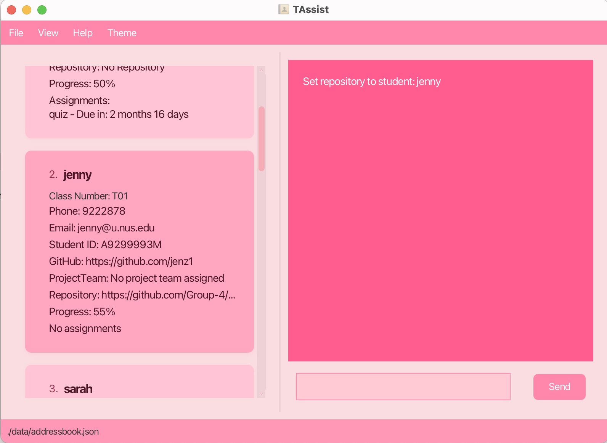
### Updating a student's progress value: `progress`

Updates the **progress value** of a student.

Format: `progress INDEX pr/PROGRESS` or `progress STUDENT_ID pr/PROGRESS`

* The `PROGRESS` shows the percentage of the student's completion status for the module or assigned tasks.
* The `PROGRESS` must be an **integer** between 0 and 100, inclusive.
* The index refers to the index number shown in the displayed student list.
* The index **must be a positive integer** 1, 2, 3, …​

Examples:
* `progress 1 pr/75`<br>
  Sets the progress of the first student in the list to 75%.
* `progress A1234567B pr/50`<br>
  Sets the progress of the student with Student ID A1234567B to 50%.

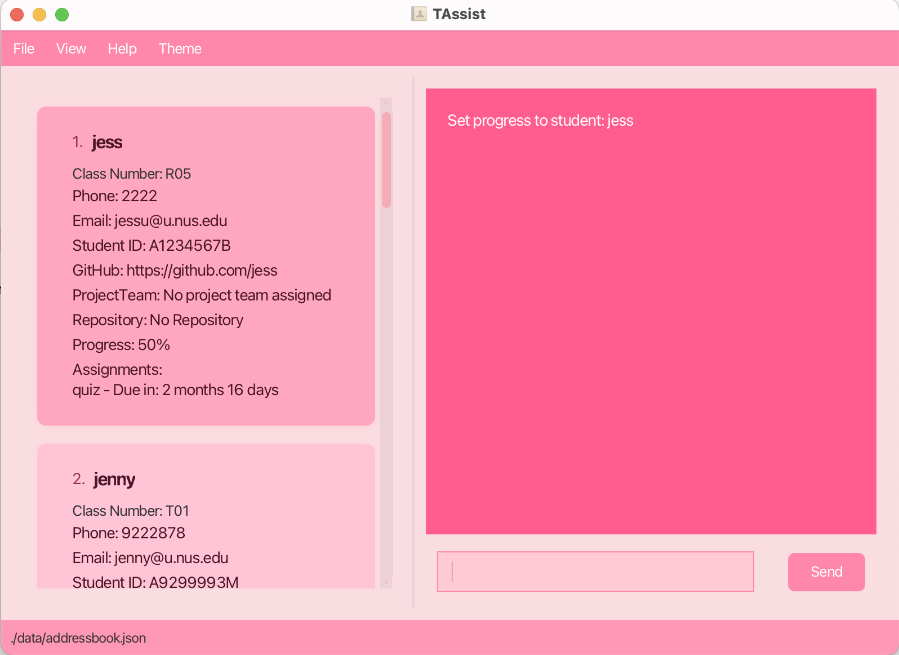
### Updating a student's GitHub Link: `github`

Updates the **GitHub URL** of a student, identified by either their displayed index or student ID.

Format: `github INDEX g/GITHUB_URL` or `github STUDENT_ID g/GITHUB_URL`

* Edits the `GITHUB_URL` of the student at the specified `INDEX` or matching `STUDENT_ID`
* The index refers to the index number shown in the displayed student list.
* The index **must be a positive integer** 1, 2, 3, …​
* The GitHub URL must be a valid URL (e.g. starts with `https://github.com/`)
* To remove a GitHub assignment, leave `g/` empty (i.e. `g/` with no value)

`GITHUB_URL`:
- Must be in the format`https://github.com/USERNAME`
- Username must be 1 to 39 characters long.
- Username must consist of alphanumeric characters that are separated only by dashes (-), if any.
- Username must start and end with an alphanumeric character.

Examples:
* `github 2 g/https://github.com/alice` <br>
  Updates the 2nd student's GitHub link to `https://github.com/alice`.
* `github A1234567B g/https://github.com/bob-dev`
  Updates the GitHub link for the student with student ID `A1234567B`.
* `github 3 g/` removes the 3rd student's GitHub link.

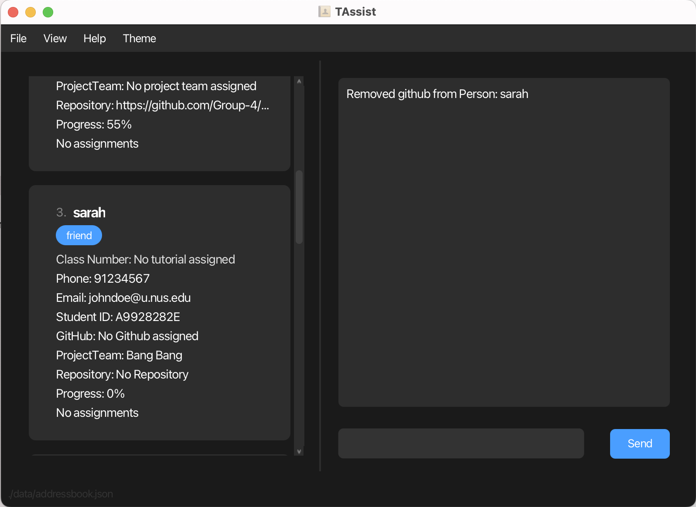
### Opening a student's GitHub page: `open`

Opens the GitHub page of a student, identified by either their displayed **index** or **student ID**, in your default web browser.

Format: `open INDEX` or `open STUDENT_ID`

* Opens the `GITHUB_URL` of the student at the specified `INDEX` or matching `STUDENT_ID`.
* The index refers to the index number shown in the displayed student list.
* The index **must be a positive integer** 1, 2, 3, …​

Examples:
* `list` followed by `open 1` opens the GitHub page of the first student shown in the list.
* `open A1234567B` opens the GitHub page of the student with student ID `A1234567B`.

### Adding a new assignment/timed event: `assignment`

Adds a **timed event** (such as an assignment, project, or deadline) to the event list, which can be used to track important upcoming tasks.

Format: `assignment n/NAME d/DATE`

* `n/NAME`: The title or description of the assignment/event.
* `d/DATE`: The deadline for the assignment/event.
* Accepted date formats: `dd-MM-yyyy`, `dd-MM-yy`, or `dd-MM` (defaults to current year)
* The date must be a valid **future date**.
* **Note:** Assignments due on the current day cannot be added. 

Examples:
* `assignment n/CS2103T Project d/30-10-2025` <br>
  Adds a timed event named "CS2103T Project" with deadline on January 30, 2025.
* `assignment n/Quiz 1 d/10-05` <br>
  Adds an event named "Quiz 1" with the deadline on April 10 of the current year.

### Viewing the timed event list and their indices: `view`
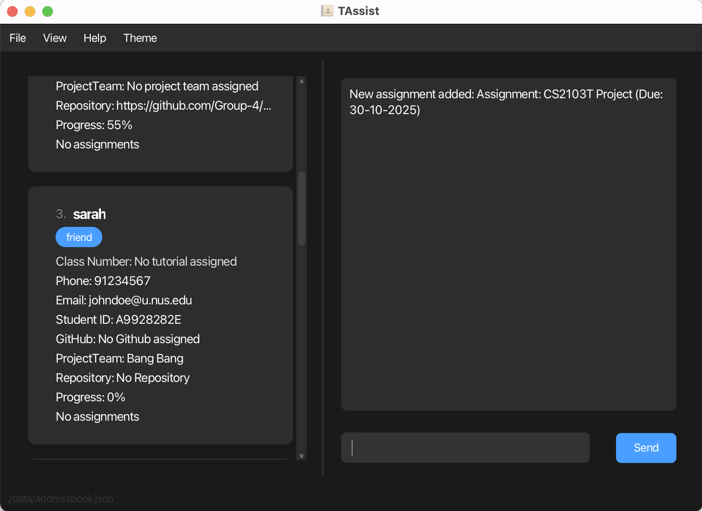
### Viewing the timed event list and their indices: `view`

**Lists all timed events** in the system.

Format: `view`
* Shows all timed events with their names and deadlines, as well as their indices.
* **Tip:** enter `view` before [assigning](#assigning-a-timed-eventassignment-assign) an assignment to manage tasks easier.
* Note that assignments that has past their deadlines are not deleted for track keeping purposes, refer to `unassign`\
    to see how to remove them.

Examples:<br>
* `view` <br>
  Displays all timed events in the timed event list.
* `view` followed by `assign T01 3` <br>
  Displayed the timed event list, and assigns the 3rd timed event to all students in class T01.

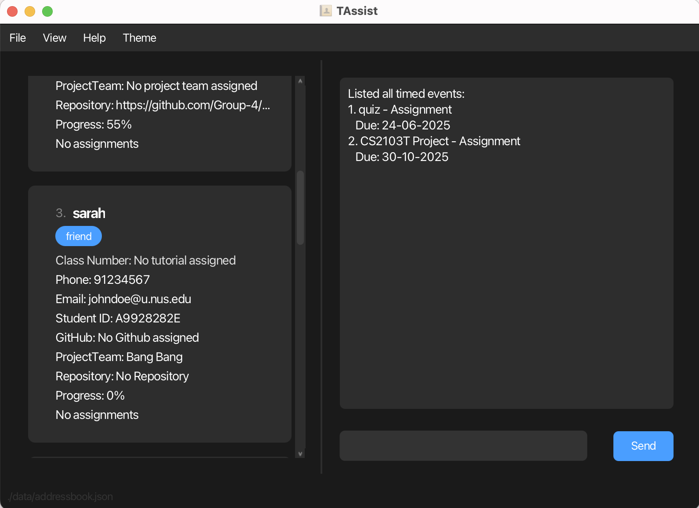
### Assigning a timed event/assignment: `assign`

**Assigns a timed event** using index in time event list to one or more students identified by their displayed index, student ID, or class number.

Format: `assign STUDENT_INDEX TIMED_EVENT_INDEX` or `assign STUDENT_ID TIMED_EVENT_INDEX` or `assign CLASS_NUMBER TIMED_EVENT_INDEX`

* `TIMED_EVENT_INDEX`: The index of the timed event shown in the timed event list (must be a positive integer).
* `STUDENT_INDEX`: The index of the student from the displayed student list (must be a positive integer).
* `STUDENT_ID`: The student ID of the target student (e.g., A1234567B).
* `CLASS_NUMBER`: The tutorial/recitation/lab class number (e.g., T01, R05, L10, L20J).

Examples:
* `assign 2 1` <br>
  Assigns the first timed event to the 2nd student in the list.

* `assign A1234567B 2` <br>
  Assigns the second timed event to the student with student ID A1234567B.

* `assign T01 1` <br>
  Assigns the first timed event to all students in class T01.

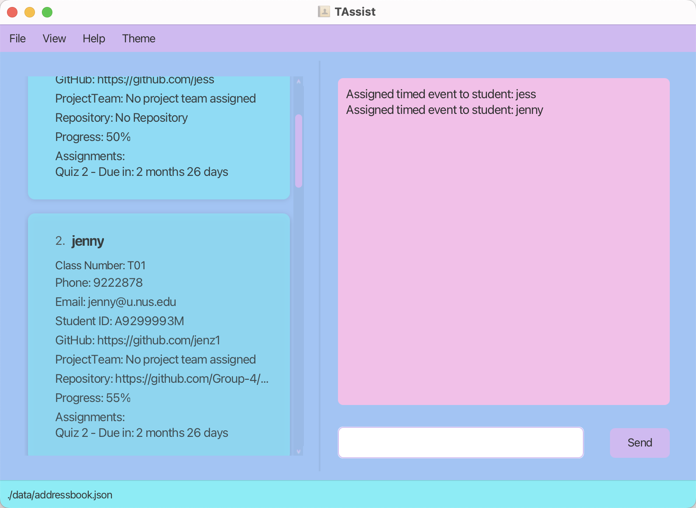
### Unassigning and Removing a Timed Event: `unassign`

**Removes a timed event** from all assigned students and **deletes** the event from the timed event list.

Format: `unassign TIMED_EVENT_INDEX`

* `TIMED_EVENT_INDEX`: The index of the timed event shown in the timed event list (must be a positive integer).
* Unassigns the specified timed event from all students who were previously assigned to it.
* Deletes the timed event from the timed event list.
* After entering the command, you will be prompted to confirm the action:
  * Type `Y` to confirm the unassignment
  * Type `N` to cancel the unassignment
  * Any other input will prompt: `Invalid response. Please enter Y/N.`
  * `Y/N` can be upper or lower case

Example:
* `unassign 1` <br>
  Unassigns the first timed event from all students and deletes the event from the list.

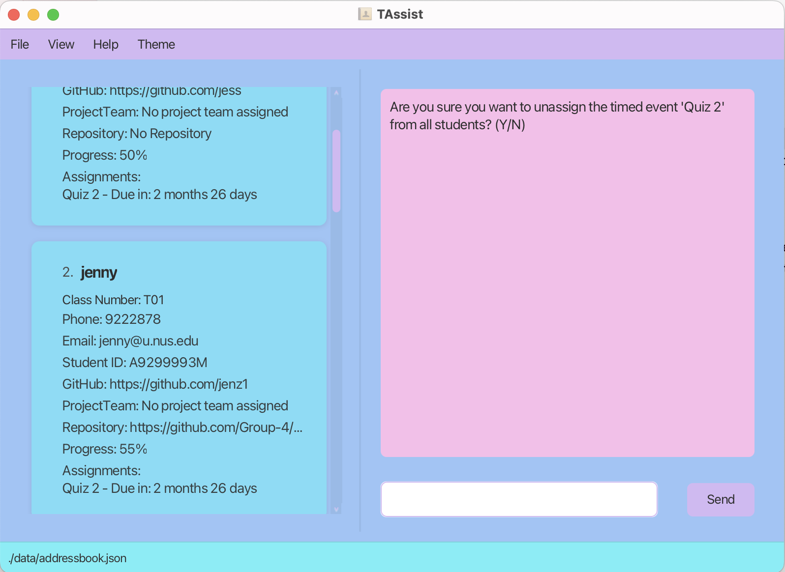
### Viewing Upcoming Events Calendar

TAssist provides a **calendar-style view** to help you visualize upcoming assignments and timed events.

* Press the `F3` key to open the calendar-style event viewer, or access it through the drop down `View --> Calendar`.
* The calendar displays:
  * Assignment names
  * Event type (e.g., assignment)
  * Assigned students
  * Dates grouped chronologically
* An empty calendar will be shown if there are no current assignments.

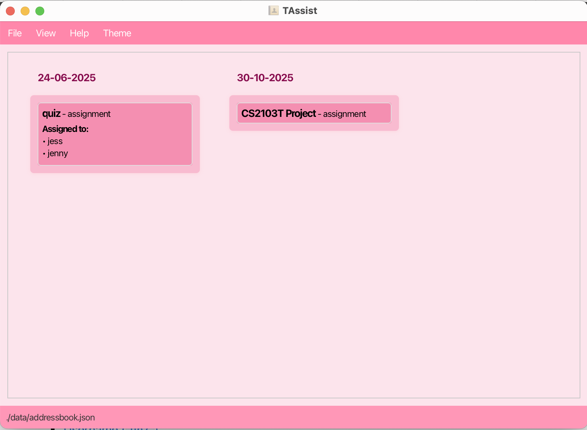
### Deleting a student : `delete`

Deletes the specified student from the student list, identified by either their displayed index or student ID.

Format: `delete INDEX` or `delete STUDENT_ID`

* Deletes the student at the specified `INDEX` or matching `STUDENT_ID`.
* The index refers to the index number shown in the displayed student list.
* The index **must be a positive integer** 1, 2, 3, …​
* After entering the command, you will be prompted to confirm the deletion:
  * Type `Y` to confirm the deletion
  * Type `N` to cancel the deletion
  * Any other input will prompt: `Invalid response. Please enter Y/N.`
  * `Y/N` can be upper or lower case

Examples:
* `list` followed by `delete 2` deletes the 2nd student from the list after confirmation.
* `find Betsy` followed by `delete 1` deletes the 1st student in the search results after confirmation.
* `delete A1234567B` deletes the student with student ID A1234567B after confirmation.

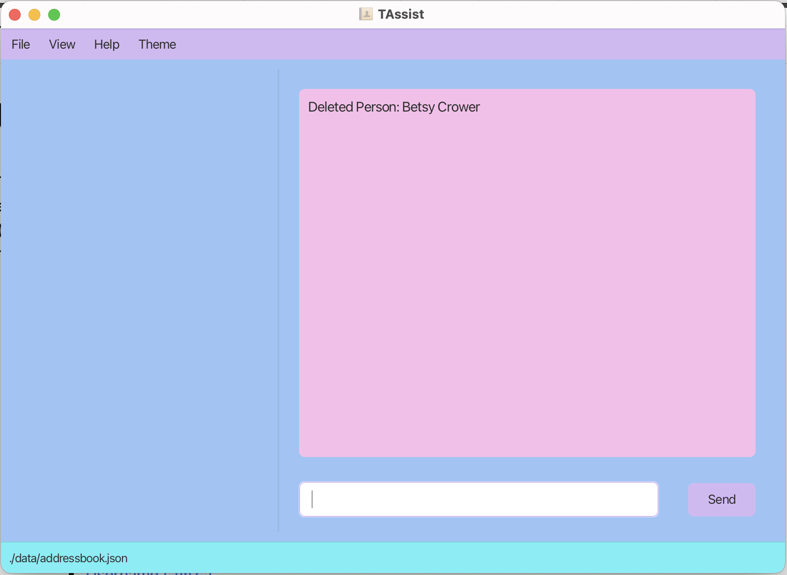
### Clearing all entries : `clear`

**Clears all entries** from the student list.

Format: `clear`

### Importing data : `import`

**Imports a CSV file** containing both student data and active timed event data into the system. The file should follow the correct CSV format for both students and timed events.

Format: `import INPUT_CSV_FILE_PATH`

* `INPUT_CSV_FILE_PATH`: The absolute path to the CSV file to be imported.
* The absolute path format is dependent on the operating system.
* Relative paths are not supported.

Examples:
* `import /Users/Alice/Documents/T01.csv` (Unix/mac) <br>
  Imports the CSV file located at `/Users/Alice/Documents/T01.csv` containing students and timed events.

* `import C:\Users\Alice\Documents\T01.csv` (Windows) <br>
  Imports the CSV file located at `C:\Users\Alice\Documents\T01.csv` containing students and timed events.

### Exporting data : `export`

**Exports the current student and active timed event data** to a CSV file. The data is written in a structured format where students' details are saved along with active timed events.

Format: `export OUTPUT_CSV_FILE_PATH`

* `OUTPUT_CSV_FILE_PATH`: The absolute path where the CSV will be saved.
* The absolute path format is dependent on the operating system.
* Relative paths are not supported.
* If the parent directory of the CSV file does not exist, an error will occur, and the file will not be created.

Examples:
* `export /Users/Alice/Documents/T01.csv` (Unix/mac) <br>
  Exports the current data containing students and timed events to `/Users/Alice/Documents/T01.csv`.

* `export C:\Users\Alice\Documents\T01.csv` (Windows) <br>
  Exports the current data containing students and timed events to `C:\Users\Alice\Documents\T01.csv`.

### Exiting the program : `exit`

**Exits** the program.

Format: `exit`

### Saving the data

TAssist data are saved in the hard disk automatically after any command that changes the data. There is no need to save manually.

### Editing the data file

TAssist data are saved automatically as a JSON file `[JAR file location]/data/addressbook.json`. Advanced users are welcome to update data directly by editing that data file.

<div markdown="span" class="alert alert-warning">:exclamation:
**Caution:**
If your changes to the data file makes its format invalid, TAssist will discard all data and start with an empty data file at the next run. Hence, it is recommended to take a backup of the file before editing it.<br>
Furthermore, certain edits can cause TAssist to behave in unexpected ways (e.g., if a value entered is outside of the acceptable range). Therefore, edit the data file only if you are confident that you can update it correctly.
</div>

---------------------------------------------------------------------------------------------------------------------
## Parameters

### `NAME`

- Must consist only of alphabets.
- Must not be blank.
- The first character must not be a whitespace.

Examples of valid names:
- Alice Gales
- Bob Smith III
- Deshaka Son Of Perera<br>

**Tip:** Names with special characters should be entered in alphaneumeric characters only, as shown above.


### `STUDENT_ID`

- Must follow the format `AXXXXXXXN`.
- Must start with the uppercase letter `A`.
- Followed by exactly 7 digits (0–9).
- Must end with an uppercase letter from A to Z.
- Both `A` and `N` must be capitalized.

Examples of valid student IDs:
- A1234567B
- A7654321Z
- A0000000X

### `PHONE`

- Must only contain numeric digits.
- Must be between 3 to 15 digits long.

Examples of valid phone numbers:
- 123
- 98765432
- 812345223789762

### `EMAIL`

- Must follow the format `local-part@u.nus.edu`.
- The local-part should contain only alphanumeric characters and periods (.).
- The local-part cannot start or end with a period, and cannot contain consecutive periods.

Examples of valid emails:
- alice123@u.nus.edu
- john.doe@u.nus.edu

### `GITHUB_URL`

- Must follow the format `https://github.com/USERNAME`.
- The base URL must be exactly `https://github.com/`.
- Must be followed by a valid GitHub username.

`USERNAME`:
- Be 1 to 39 characters long.
- Consist of alphanumeric characters.
- Be separated only by dashes (-), if any.
- Start and end with an alphanumeric character. 
- Alternatively, this field can be left blank to remove the GitHub link from a student, using [Github Command](#updating-a-students-github-link-github)

Examples of valid GitHub links:
- https://github.com/JohnnyDoe
- https://github.com/alice-smith
- https://github.com/x1

### `REPOSITORY_URL`

- Must follow the format `https://github.com/USERNAME/REPOSITORY_NAME`.

`USERNAME`:
- Must be 1 to 39 characters long.
- Made up of alphanumeric characters.
- Separated by dashes (-) between segments.
- Cannot start or end with a dash.

`REPOSITORY_NAME`:
- Made up of alphanumeric characters.
- Can contain dashes (-), underscores (_), and dots (.).
- Cannot be empty.
- Must start and end with an alphanumeric character.

Examples of valid repository links:
- https://github.com/johnny-fargo/new_repo
- https://github.com/AY2425S2-CS2103T-W12-4/tp

### `CLASS_NUMBER`

- Must be in the format `Txx`, `Rxx` or `Lxx`, where `xx` is a two-digit number from 01 to 99.
- The first letter must be either `T` or `R` (uppercase).
- The numeric part must be a valid number between 01 and 99.
- If assigning 'Lxx', a capital letter suffix is optional (e.g. L01A).
- Alternatively, this field can be left blank to remove a class assignment, using [Class Command](#assigning-or-removing-a-tutorial-class-class)

Examples of valid class numbers:
- T01
- R23
- L99
- L20M

### `PROGRESS`

- Must be an integer between 0 and 100, inclusive.
- A trailing percent sign (`%`) is allowed but will be ignored during parsing.

Examples of valid progress values:
- 0
- 75
- 100
- 45% (trailing percent sign is accepted)

### `PROJECT_TEAM`

- Can take any value, but must not be blank.
- The first character must not be a whitespace.

Examples of valid project team values:
- Alpha Squad
- Team42
- dev-x

--------------------------------------------------------------------------------------------------------------------

## FAQ

**Q**: How do I transfer my data to another Computer?<br>
**A**: Install the app in the other computer and overwrite the empty data file it creates with the file that contains the data of your previous TAssist home folder.

--------------------------------------------------------------------------------------------------------------------

## Known issues

1. **When using multiple screens**, if you move the application to a secondary screen, and later switch to using only the primary screen, the GUI will open off-screen. The remedy is to delete the `preferences.json` file created by the application before running the application again.
2. **If you minimize the Help Window** and then run the `help` command (or use the `Help` menu, or the keyboard shortcut `F1`) again, the original Help Window will remain minimized, and no new Help Window will appear. The remedy is to manually restore the minimized Help Window.
3. Users must provide inputs according to the parameters specified in the User Guide. If an invalid or unrecognized parameter is used, TAssist will treat it as an error related to the previous valid parameter.<br>
   For example: <br>
   `assignment n/quiz pr/30 d/22-11-2027`<br>
   `assignment n/quiz ab/xx d/22-11-2027`<br>
   Both examples will result in an error message related to the `name` parameter:<br>
   "Name should only contain alphanumeric characters and spaces, and it should not be blank."<br>
   This is because pr/30 and ab/xx are not valid parameters for the assignment command.

--------------------------------------------------------------------------------------------------------------------

## Command summary

Action | Format, Examples
--------|------------------
**Add** | `add n/NAME p/PHONE_NUMBER e/EMAIL s/STUDENT_ID [g/GITHUB_URL] [pt/TEAM] [c/CLASS_NUMBER] [t/TAG]…​ [pr/PROGRESS]` <br> e.g. `add n/John Doe p/98765432 e/johnd@eu.nus.edu s/A0000000B g/https://github.com/username c/T02 t/friends t/owesMoney pr/50`
**Clear** | `clear`
**Delete** | `delete INDEX` or `delete STUDENT_ID`<br> e.g., `delete 3`, `delete A1234567B`
**Edit** | `edit INDEX [n/NAME] [p/PHONE] [e/EMAIL] [s/STUDENTID] [g/GITHUB_URL] [pt/TEAM] [c/CLASS_NUMBER] [t/TAG]…​ [pr/PROGRESS]`<br> e.g.,`edit 2 n/James Lee e/jameslee@u.nus.edu`
**Find** | `find KEYWORD [MORE_KEYWORDS]` or `find STUDENT_ID` or `find CLASS_NUMBER` <br> e.g., `find James Jake`, `find A1234567B`
**List** | `list [f/FILTER_TYPE fv/FILTER_VALUE] [s/SORT_TYPE o/SORT_ORDER]`<br> e.g.,`list f/progress fv/50 s/name o/des`
**Class** | `class INDEX c/CLASS_NUMBER` or `class STUDENT_ID c/CLASS_NUMBER` <br> e.g.,`class 1 c/T01`, `class A7654321B c/T02`, `class 2 c/L05`, `class A1234567W c/L15C`
**Progress** | `progress INDEX pr/PROGRESS` or `progress STUDENT_ID pr/PROGRESS` <br> e.g., `progress 1 pr/75`, `progress A1234567B pr/50`
**Github** | `github INDEX g/GITHUB_URL` or `github STUDENT_ID g/GITHUB_URL`<br> e.g.,`github 2 g/https://github.com/alice`, `github A1234567B g/https://github.com/alice`
**Repository** | `repo INDEX un/USERNAME rn/REPOSITORY_NAME` or `repo INDEX r/REPOSITORY_URL` or `repo STUDENT_ID un/USERNAME rn/REPOSITORY_NAME` or `repo STUDENT_ID r/REPOSITORY_URL` <br> e.g.,`repo 2 r/https://github.com/alice/repo`, `github A1234567B un/barb rn/new`
**Open** | `open INDEX` or `open STUDENT_ID` <br> e.g., `open 3`, `open A7654321B`
**Assignment** | `assignment n/NAME d/DATE` <br> e.g.,`assignment n/CS2103T Project d/30-10-2025`
**View** | `view`
**Assign** | `assign STUDENT_INDEX TIMED_EVENT_INDEX` or `assign STUDENT_ID TIMED_EVENT_INDEX` or `assign CLASS_NUMBER TIMED_EVENT_INDEX` <br> e.g., `assign 2 1`, `assign A1234567B 2`,`assign T03 2`
**Unassign** | `unassign TIMED_EVENT_INDEX` <br> e.g., `unassign 1`
**Import** | `import ABSOLUTE_FILE_PATH` <br> e.g., `import /Users/Alice/Documents/T01.csv` (Unix/mac), `import C:\Users\Alice\Documents\T01.csv` (Windows)
**Export** | `export ABSOLUTE_FILE_PATH` <br> e.g., `export /Users/Alice/Documents/T01.csv` (Unix/mac), `export C:\Users\Alice\Documents\T01.csv` (Windows)
**Help** | `help`
